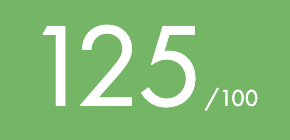

# Hi there 👋

I'm a student at 42 school in Paris currently working at YesWeHack as an Full Stack developper. 
I embarked on my coding journey at 42, during the September 2022 Piscine. I finished the Core Curriculum in February 2024.
# My progress at 42 school

## Projets
| Project | Description | Language | Subject | Score |
| :-----: | :---------: | :------: | :-----: | :---: |
| <a href="subjects/libft.subject.pdf">Libft | Implementation of basic libc functions | C | Algorithm |  |
<!--
**haoov/haoov** is a ✨ _special_ ✨ repository because its `README.md` (this file) appears on your GitHub profile.

Here are some ideas to get you started:

- 🔭 I’m currently working on ...
- 🌱 I’m currently learning ...
- 👯 I’m looking to collaborate on ...
- 🤔 I’m looking for help with ...
- 💬 Ask me about ...
- 📫 How to reach me: ...
- 😄 Pronouns: ...
- ⚡ Fun fact: ...
-->
